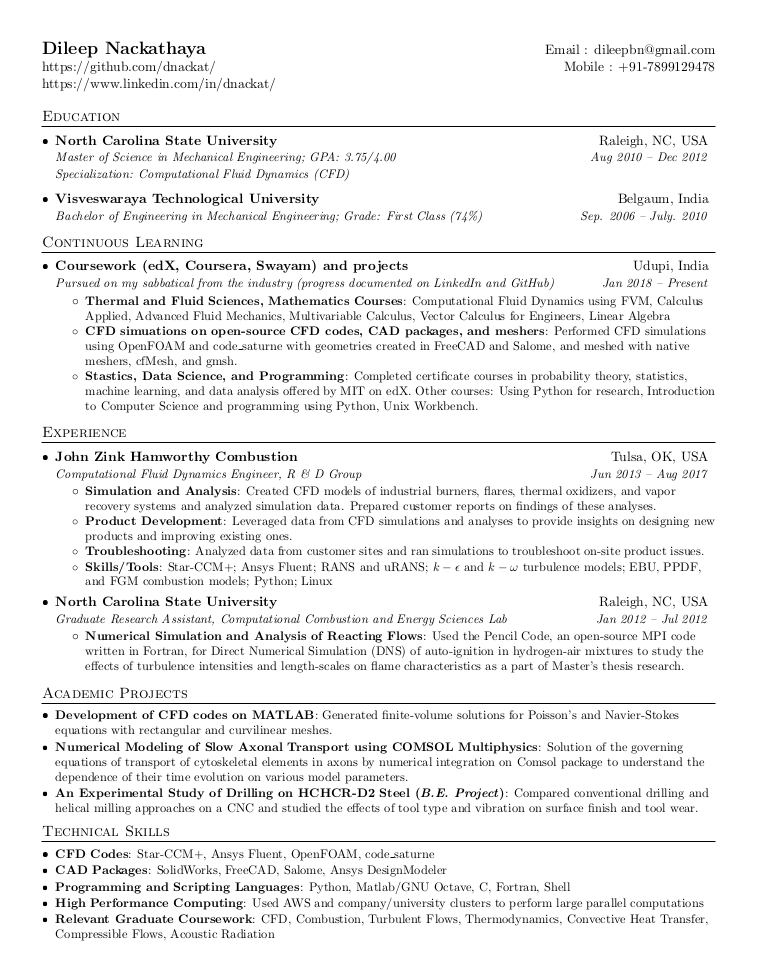

__Status__: _In Progress_    

A crisp single-page, one-column resume for software developers created by [Saurabh Bajaj](https://github.com/sb2nov/resume) that I edited to make it a little more friendly to non-CS engineers. 

### Motivation (writen by Saurabh)

I created this template as managing a resume on Google Docs was hard and changing any formatting was too difficult since it had to be applied in multiple places. Most currently available templates either focus on two columns, or are multiple pages long. I personally found the two-column templates hard to focus while multiple-page resumes were just too long to be used in career fairs.

### Preview

### License
Originally licensed (MIT format) by Saurabh Bajaj. Edited parts are licensed (MIT format) by Dileep Nackathaya.
